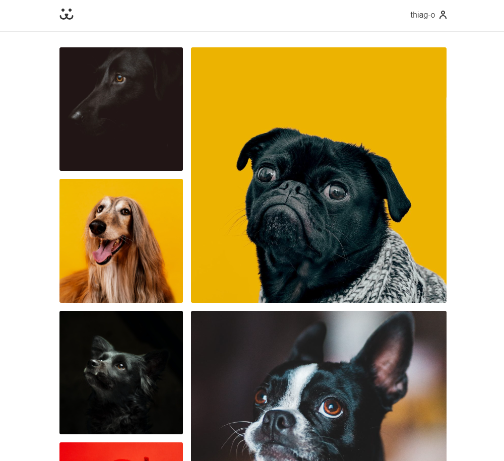

# Dogs - Rede Social Canina :paw_prints:

Dogs é uma rede social dedicada aos amantes de cachorros, onde os usuários podem compartilhar informações sobre seus adoráveis companheiros de quatro patas. O aplicativo permite aos usuários postar fotos e características de seus cães, além de visualizar e comentar nas postagens de outros usuários. Conta com um sistema de cadastro e login.

Acesse aqui a rede social: [Dogs](https://dogs-gamma-lime.vercel.app/)

Este projeto foi desenvolvido como parte do curso **"React Completo"** oferecido pela **Origamid**, com o objetivo de fornecer uma plataforma interativa e divertida para os apaixonados por cães compartilharem suas experiências e se conectarem com outros amantes de pets.

## :pencil2: Funcionalidades

- [x] **Cadastro e Login:** Sistema de autenticação seguro para criar e acessar contas de usuário.
- [x] **Postagens:** Capacidade de criar postagens contendo fotos e textos sobre os cães.
- [x] **Visualização e Comentários:** Os usuários podem visualizar as postagens de outros usuários e interagir através de comentários.
- [x] **Perfil do Usuário:** Página dedicada a cada usuário onde é possível visualizar todas as postagens feitas por ele.
- [x] **Feed de Atividades:** Exibição de um feed com as postagens.
- [x] **Design Responsivo:** Interface adaptável para garantir uma experiência consistente em diferentes dispositivos e tamanhos de tela.

## :rocket: Instalação

**Dependência**: Node 14.17.0

1. Clone este repositório em sua máquina local `git clone git@github.com:thiag-o/dogs.git`.
2. Instale as dependências do projeto executando `npm install`.
3. Faça a build do projeto executando `npm run build`
4. Inicie o servidor local digitando `npm start`.
5. Acesse a aplicação através do navegador utilizando o endereço `http://localhost:3000`.
6. Cadastre-se ou faça login para começar a explorar e interagir na rede social canina Dogs!

## :books: Tecnologias

## Licença

[MIT](https://choosealicense.com/licenses/mit/)
